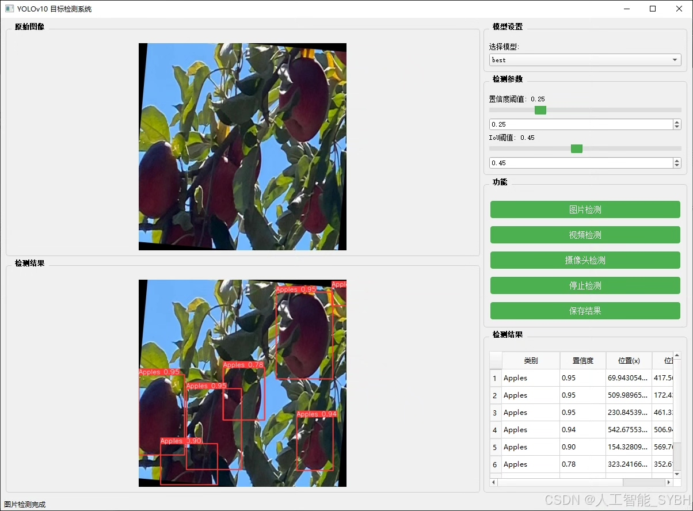
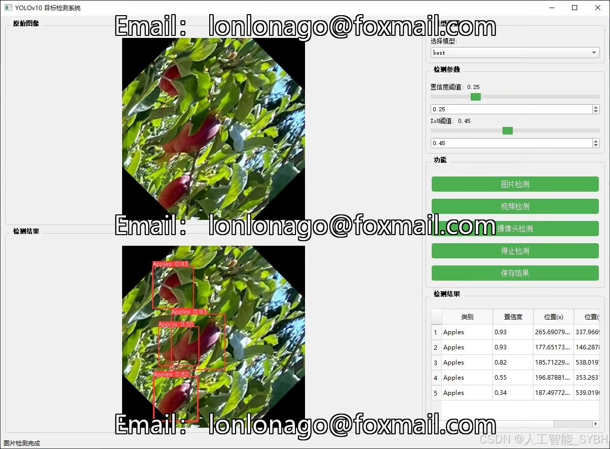
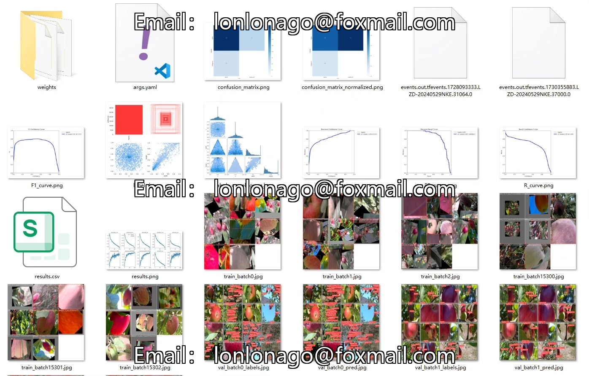
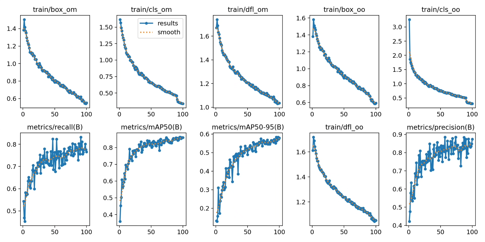
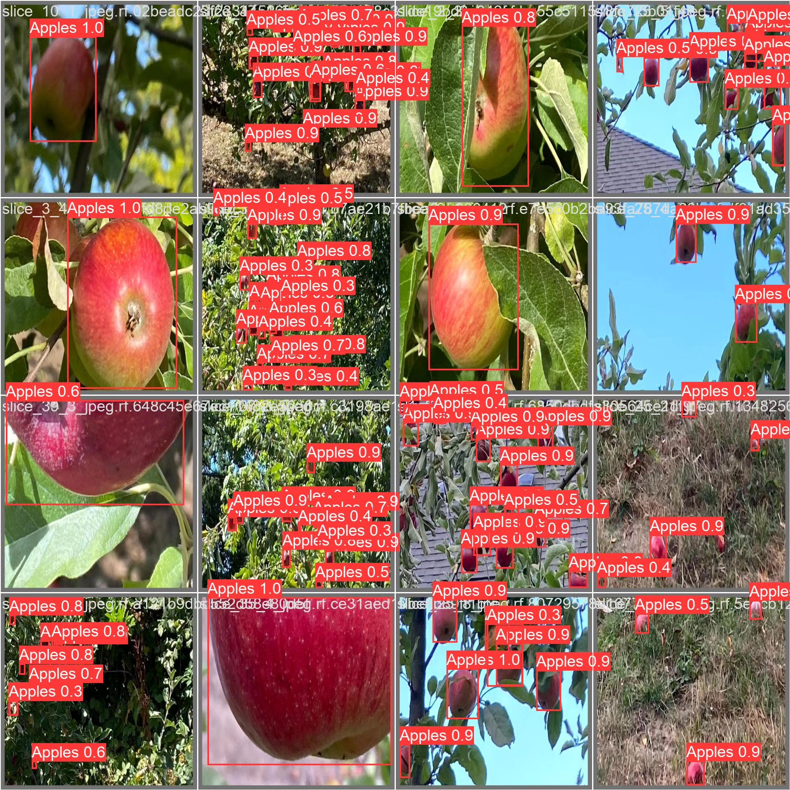
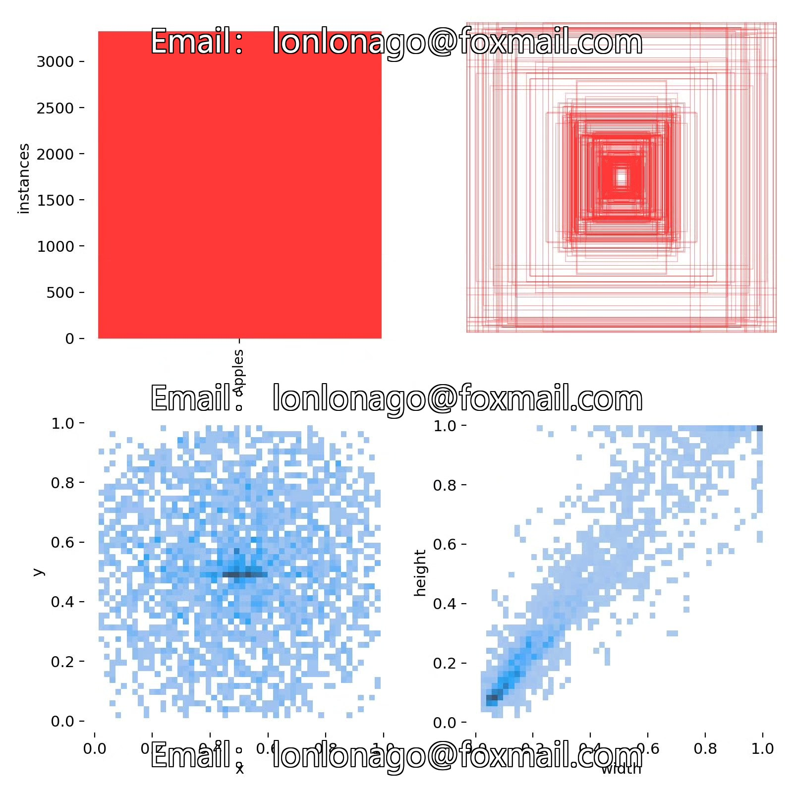
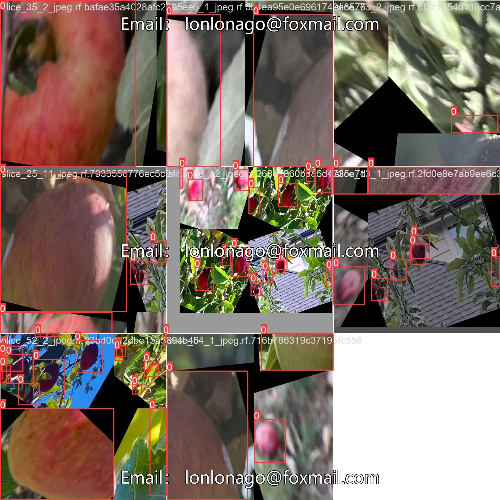

# A Detection System for Apples on Trees Based on YOLOv10 Deep Learning

## Body

This is a Python project that uses the YOLOv10 deep learning model to detect apples on trees. The project includes the following components:

1. YOLOv10 dataset
2. UI interface
3. Python project source code
4. Model

Here are the steps to complete this project:

1. Install the required libraries and download the YOLOv10 dataset from the official website.

```bash
pip install -r requirements.txt
python train_yolov10.py
```

2. Create a UI interface using a web framework like Flask or Django. You can use the built-in Flask library or any other web framework of your choice.

3. Write the Python project source code for training the YOLOv10 model, loading the dataset, and running the inference.

4. Train the YOLOv10 model using the trained weights and save them in a file.

5. Run the inference using the trained model and display the results on the UI interface.

6. Modify the UI interface to display more information about the detected apples, such as their locations, sizes, and shapes.

7. Test the system thoroughly to ensure that it works correctly and meets the desired performance metrics.

8. Deploy the system as a web service or integrate it with other applications to provide real-time apple detection capabilities.

YOLOv10 is an intelligent system based on the YOLOv10 (You Only Look Once version 10) object detection algorithm, specifically designed for detecting apples on trees. This system can automatically identify and locate apples on trees, suitable for orchard management, automated picking, yield estimation, and other scenarios. Through this system, users can quickly detect the number and location of apples on trees, optimize orchard management processes, improve picking efficiency, and provide data support for yield estimation.

The company's products have obtained the official commercial license certification from YOLO.

After-sales service

After the payment is successful, we will provide a WeChat account number, and you can ask questions anytime.

Environment Configuration: A tutorial on environment configuration will be provided, and WeChat will provide Q&A.

Remote Installation Service: If you need to remotely configure the environment, an additional fee of 69 is required.
Configuration unsuccessful, all fees are refunded (specially for older computers, only installation fees are refunded).

Retrain the dataset: After setting up the environment, you can train on your own computer.
If you need us to train it for you, just pay 69 plus the computing power fee (2.5 yuan per hour).

Full package of after-sales service

## Images












## Payment

Here is a pay link on Stripe ( https://buy.stripe.com/3cs8yP7sY87d0vu9AB ). Please contact me lonlonago@foxmail.com after funding $89, and I will send you a complete data files , thank you!


